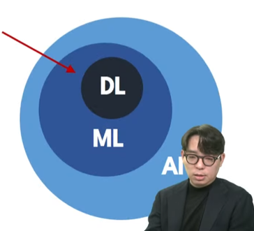
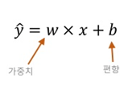
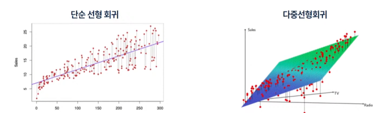
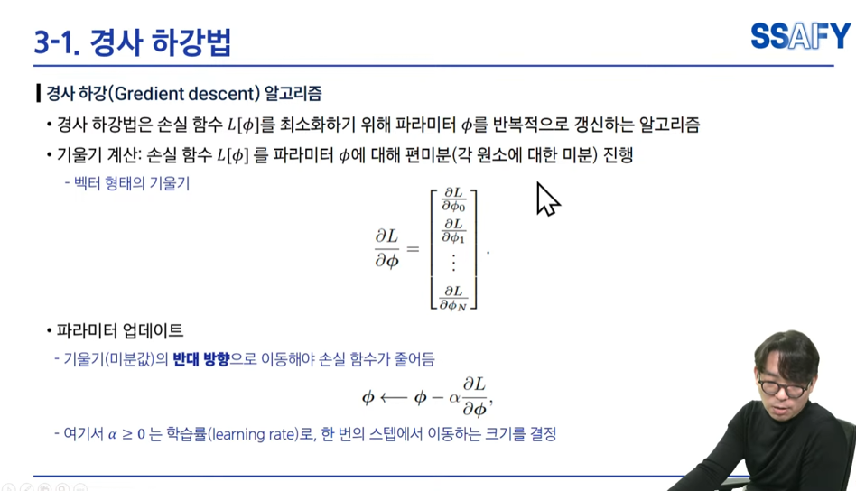
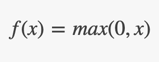
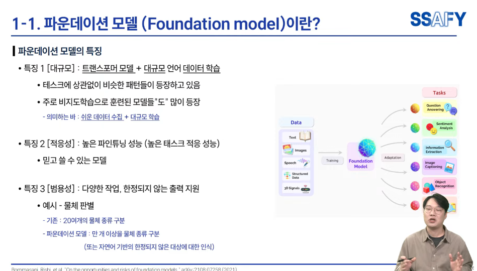

# AI의 진화: 규칙 기반에서 파운데이션 모델까지
## 1주 차 스터디 - 머신러닝의 뼈대 완벽하게 잡기
**발표자:** 김준태

---

## 패러다임의 전환: 기계가 학습한다는 것

**과거 (Rule-based)**
* 데이터 + 규칙(if-else 코드) ➡️ 결과 출력
* 사람이 직접 모든 예외 상황을 설계해야 함 (한계 도달)

**현재 (Machine Learning)**
* 데이터(Feature) + 정답(Label) ➡️ **규칙(모델) 출력**
* 기계가 스스로 데이터 안에서 숨겨진 패턴(가중치)을 찾아냄

---

## AI, ML, DL의 명확한 관계

* **인공지능 (AI):** 사람의 지능을 모방하는 모든 기술
* **머신러닝 (ML):** 데이터에서 스스로 규칙을 학습하는 기술
* **딥러닝 (DL):** 인간의 뇌(인공신경망)를 모방하여 더 복잡하고 깊은 패턴을 학습

---

## 예측의 뼈대: 선형 회귀 (Linear Regression)

**목표:** 데이터의 경향성을 가장 잘 나타내는 **'단 하나의 선'** 찾기

**핵심 수식:** $H(x) = Wx + b$

* $x$: 입력 데이터 (Feature)
* $W$ (**Weight**, 가중치): 선의 기울기 (변수가 결과에 미치는 영향력)
* $b$ (**Bias**, 편향): 선의 영점 조절 (활성화 임계값)

---

## 기계는 정답을 어떻게 찾아갈까? (최적화)

* **비용 함수 (Cost Function):** 정답과 예측값의 오차 (MSE, Cross-Entropy 등)
* **경사하강법 (Gradient Descent):** 오차가 가장 적은 밑바닥을 향해 내려가는 알고리즘
* **학습률 (Learning Rate):** 한 번에 내려가는 보폭. 너무 크면 발산하고, 너무 작으면 학습이 느려짐 (실무 튜닝의 핵심)

---

## 비선형성의 마법: 활성화 함수 (Activation Function)

선형 연산($Wx+b$)만 겹겹이 쌓으면 결국 하나의 선형 함수가 됨. 신경망에 **'비선형성'**을 부여하여 복잡한 문제를 풀게 하는 스위치 역할!

* **Sigmoid:** 0~1 사이로 값을 변환. 층이 깊어지면 기울기가 소실되는 치명적 단점 발생 (Vanishing Gradient)
* **ReLU:** $f(x) = \max(0, x)$. 0 이하는 버리고 양수는 그대로 통과. **기울기 소실 문제를 해결하며 딥러닝의 폭발적 발전을 이끈 1등 공신**

---

## 이미지 처리의 한계와 CNN의 등장

**기존 방식 (FCN)의 치명적 한계**
* 2차원 이미지를 1차원(한 줄)으로 길게 펴서 학습
* 🚨 코 옆에 눈이 있다는 **'공간적 정보(Topology)'가 완전히 파괴됨**

**해결책 (CNN)** * 이미지를 펴지 않고 3차원 공간 구조(가로, 세로, 채널)를 그대로 유지하며 특징을 학습

---

## CNN의 디테일: Filter, Stride, Padding

**1. 특징 추출 (Convolution)**
* **Filter (Kernel):** 이미지를 훑으며 윤곽선, 질감 등 특정 피처를 뽑아내는 돋보기
* **Stride:** 필터가 한 번에 이동하는 칸 수 (보폭)
* **Padding:** 필터를 거치면 이미지가 작아지는 문제를 막기 위해, 테두리에 0(Zero)을 씌워 원래 크기를 유지하는 기술

---

## CNN의 디테일: Pooling과 과적합 방지

**2. 크기 축소 (Pooling)**
* **Max Pooling:** 특정 영역에서 가장 강한 특징(최댓값)만 남기고 해상도를 줄여 연산량을 대폭 감소시킴

**3. 과적합(Overfitting) 방지: Dropout**
* 학습 시 신경망의 일부 뉴런을 무작위로 꺼버림(0으로 만듦)으로써, 특정 뉴런에만 의존하는 현상을 막고 모델의 일반화 성능을 높임

---

## AI의 현재: 파운데이션 모델 (Foundation Model)

* **사전 학습 (Pre-training):** 방대한 인터넷 데이터로 모델에게 '범용적인 기초 지식'을 먼저 가르침 (거대한 뇌 생성)
* **미세 조정 (Fine-tuning):** 우리가 원하는 특정 목적(의료, 법률, 게임 등)의 소량 데이터만 추가로 학습시켜 맞춤형 모델 완성

---

## 이번 주 실습 과제

**목표:** 거창한 세팅 대신, 눈으로 직접 원리 확인하기!

1. **Jupyter Notebook** 켜기
2. `Scikit-learn`으로 단순 선형 회귀 실행 및 $W, b$ 값 변화 확인
3. `PyTorch`나 `TensorFlow`로 ReLU 함수 그래프 직접 그려보기

**질문 & 토론 시작!**